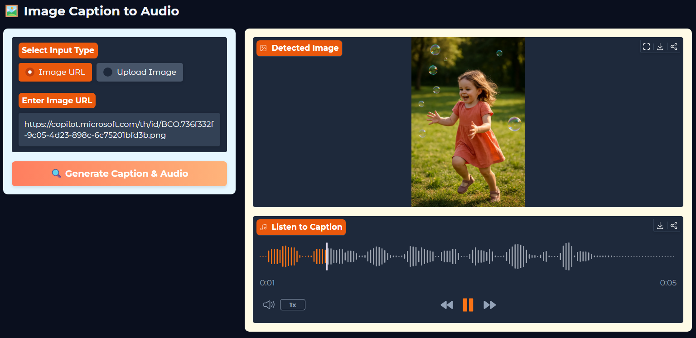
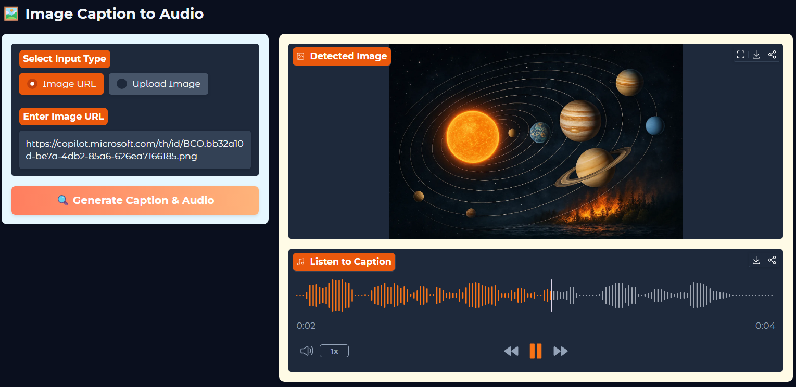

# 🖼️ Image Caption to Audio

A simple, interactive web app that takes an image (via URL or file upload), generates a natural‑language caption using a vision‑language model, and converts that caption into an audio clip you can play or download.  
Built with [Gradio](https://gradio.app/), [Hugging Face Transformers](https://huggingface.co/transformers/), and [gTTS](https://pypi.org/project/gTTS/).

---

## 🚀 Live Demo
[](https://huggingface.co/spaces/liljujutsu/Imaginary_Audio)

---

## 📸 SHOW CASE

| SHOW 1                         |
| ------------------------------ |
|  |

| SHOW 2                         |
| ------------------------------ |
|  |

---

## ✨ Features
- **Dual Input Mode** — Paste an image URL or upload a file.
- **Automatic Captioning** — Uses a Hugging Face vision‑language model to describe the image.
- **Audio Output** — Converts the caption into speech with gTTS.
- **Responsive UI** — Works on desktop and mobile.
- **Custom Theme** — Styled with Gradio’s theme system.

---

## 🛠️ Tech Stack
- **Python 3.10+**
- [Gradio](https://gradio.app/) — Web UI
- [Transformers](https://huggingface.co/transformers/) — Model inference
- [Pillow](https://pillow.readthedocs.io/) — Image handling
- [gTTS](https://pypi.org/project/gTTS/) — Text‑to‑speech
- [Requests](https://docs.python-requests.org/) — Fetch images from URLs

---

## 📦 Installation

1. **Clone the repository**
   ```bash
   git clone https://github.com/yourusername/image-caption-audio.git
   cd image-caption-audio
   ```

2. **Create a virtual environment (optional but recommended)**
   ```bash
   python -m venv .venv
   source .venv/bin/activate   # Linux/Mac
   .venv\Scripts\activate      # Windows
   ```

3. **Install dependencies**
   ```bash
   pip install -r requirements.txt
   ```

4. **Run the app**
   ```bash
   python app.py
   ```

---

## 🖥️ How to Use

1. **Launch the app** — It will open in your browser automatically.
2. **Choose input type**:
   - **Image URL** — Paste a direct link to an image.
   - **Upload Image** — Select an image file from your device.
3. **Click "Generate Caption & Audio"** — The app will:
   - Detect and describe the image.
   - Convert the description into an audio clip.
4. **View & Listen**:
   - The image will be displayed in the output panel.
   - The audio player will let you play or download the spoken caption.

---

## 📝 Example

**Input:**  


**Generated Caption:**  
> "A golden retriever puppy sitting on green grass in sunlight."

**Audio Output:**  
🎵 MP3 file with the spoken caption.

---

## ⚙️ Configuration

You can change the model in `app.py`:
```python
Assist = pipeline("image-to-text", model="Salesforce/blip-image-captioning-large")
```
Other options:
- `"Salesforce/blip-image-captioning-base"` — smaller, faster.
- `"Salesforce/blip2-flan-t5-xl"` — richer captions, heavier.

---

## 📄 License
MIT License © 2025 khushal

---

## 🙌 Acknowledgements
- [Salesforce BLIP](https://huggingface.co/Salesforce) for the image captioning models.
- [Gradio](https://gradio.app/) for the interactive UI.
- [Hugging Face](https://huggingface.co/) for model hosting.
- [gTTS](https://pypi.org/project/gTTS/) for text‑to‑speech.
