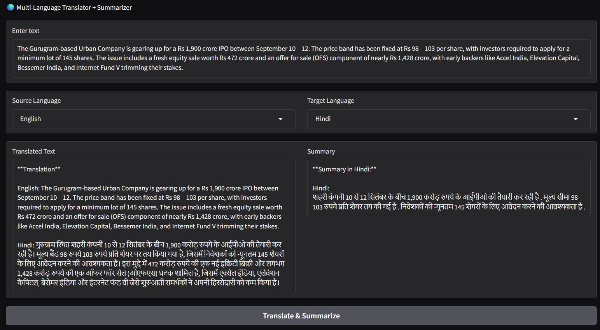

# 🌍 Multi-Language Translator + Summarizer

A simple **Gradio web app** that translates text between **200+ languages** using [NLLB-200](https://huggingface.co/facebook/nllb-200-distilled-600M), and generates concise summaries with the **FalconsAI summarization model**.  
Perfect for quickly understanding text across languages with optional summaries in **English** or the **target language**.

---

## 🚀 Live Demo

👉 [Try it here](https://huggingface.co/spaces/liljujutsu/Translation_Summary)  


---

## ✨ Features

- Translate between 200+ languages
- Summarize text in English (default) or target language
- Prevents repetition in summaries with beam search + penalties
- User-friendly Gradio interface
- Works locally or deployable on Hugging Face Spaces

---

## 🖼️ Demo Screenshot

| App |
|---------------------|
|  | 


---

## ⚙️ Installation

1. Clone the repo:
   ```bash
   git clone https://github.com/your-username/multi-lang-translator.git
   cd multi-lang-translator
````

2. Install dependencies:

   ```bash
   pip install -r requirements.txt
   ```

3. Run the app:

   ```bash
   python app.py
   ```

4. Open the Gradio link in your browser (usually `http://127.0.0.1:7860/`).

---

## 📦 Requirements

* Python 3.8+
* Transformers
* Torch
* Gradio
* Pandas

Install all with:

```bash
pip install torch transformers gradio pandas
```

---

## 🛠️ Usage

* Enter your text in the input box.
* Choose **Source Language** and **Target Language**.
* Click **Translate & Summarize**.

---

## 📌 Example

**Input (English):**

```
The Gurugram-based Urban Company is gearing up for a Rs 1,900 crore IPO between September 10 – 12. The price band has been fixed at Rs 98 – 103 per share, with investors required to apply for a minimum lot of 145 shares. The issue includes a fresh equity sale worth Rs 472 crore and an offer for sale (OFS) component of nearly Rs 1,428 crore, with early backers like Accel India, Elevation Capital, Bessemer India, and Internet Fund V trimming their stakes.
```

**Output (Hindi Translation):**

```
Hindi: गुरुग्राम स्थित शहरी कंपनी 10 से 12 सितंबर के बीच 1,900 करोड़ रुपये के आईपीओ की तैयारी कर रही है। मूल्य बैंड 98 रुपये 103 रुपये प्रति शेयर पर तय किया गया है, जिसमें निवेशकों को न्यूनतम 145 शेयरों के लिए आवेदन करने की आवश्यकता है। इस मुद्दे में 472 करोड़ रुपये की एक नई इक्विटी बिक्री और लगभग 1,428 करोड़ रुपये की एक ऑफर फॉर सेल (ओएफएस) घटक शामिल है, जिसमें एक्सेल इंडिया, एलेवेशन कैपिटल, बेसेमर इंडिया और इंटरनेट फंड वी जैसे शुरुआती समर्थकों ने अपनी हिस्सेदारी को कम किया है।
```

**Summary:**

```
शहरी कंपनी 10 से 12 सितंबर के बीच 1,900 करोड़ रुपये के आईपीओ की तैयारी कर रही है . मूल्य सीमा 98 103 रुपये प्रति शेयर तय की गई है . निवेशकों को न्यूनतम 145 शेयरों के लिए आवेदन करने की आवश्यकता है .
```

---

## 📜 License

MIT License © 2025 khushal

