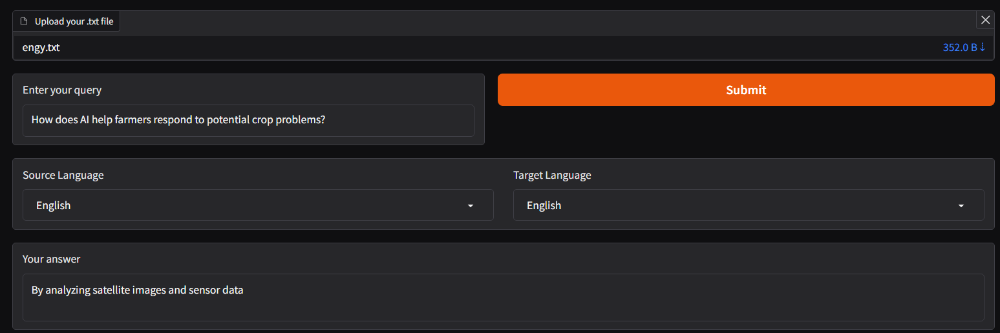
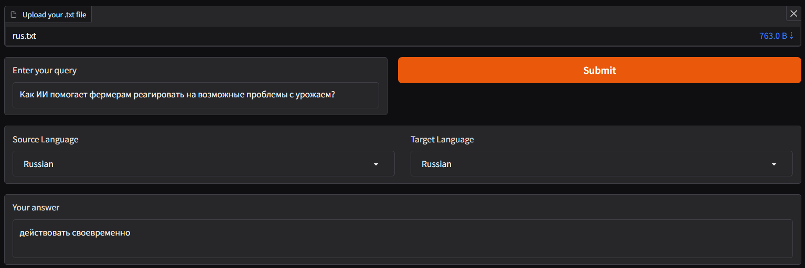
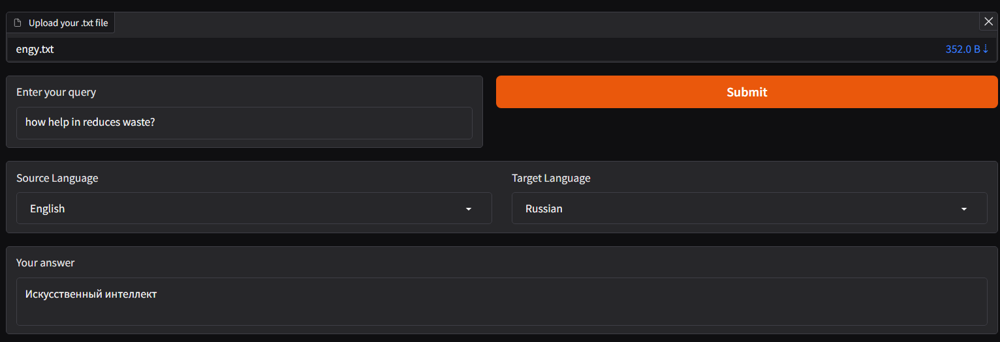

# 🌐 Multilingual QA System with Translation + QA

This project combines **machine translation** and **question-answering (QA)** into a single pipeline.  
Users can upload a `.txt` file in **any supported language**, ask a query in the **same source language**, and get the **answer in their chosen target language**.

---

## 🚀 Features
- Upload `.txt` files in multiple languages
- Translate file & query into **English** (intermediate language for QA)
- Run **Question Answering** using [deepset/roberta-base-squad2](https://huggingface.co/deepset/roberta-base-squad2)
- Translate final answer back to **target language**
- Simple **Gradio UI** for interaction

---

## 📌 Live Demo
👉 [Try it Live](https://huggingface.co/spaces/liljujutsu/Mulitilanguage_QnA)  


---

## 🖼️ Demo Screenshot
|  English to English |
|---------------------|
|  | 
| Russian to Russian |
|---------------------|
|  | 
| English to Russian |
|---------------------|
|  | 


---

## ⚙️ Installation

Clone the repo:
```bash
git clone https://github.com/yourusername/multilingual-qa.git
cd multilingual-qa
````

Install dependencies:

```bash
pip install torch transformers gradio pandas
```

---

## ▶️ Run Locally

```bash
python app.py
```

The Gradio app will launch at:

```
http://127.0.0.1:7860
```

---

## 🛠️ Tech Stack

* **[Transformers](https://huggingface.co/docs/transformers/)** (HuggingFace pipelines)
* **[Gradio](https://gradio.app/)** (UI interface)
* **Pandas** (language map lookup)
* **PyTorch** (model backend)

---

## 🌍 Supported Languages

* Hindi, English, French, German, Spanish, Chinese, Arabic, Urdu, Tamil, Telugu, Marathi, Gujarati, Kannada, Malayalam, … *(extendable to 200+ with NLLB-200)*

---

## 📜 License

MIT License © 2025 \[khushal]

```

