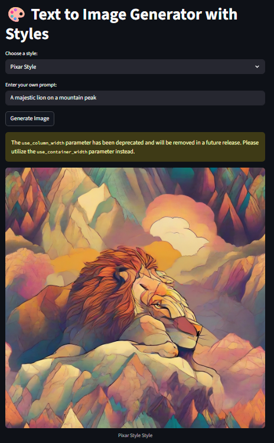
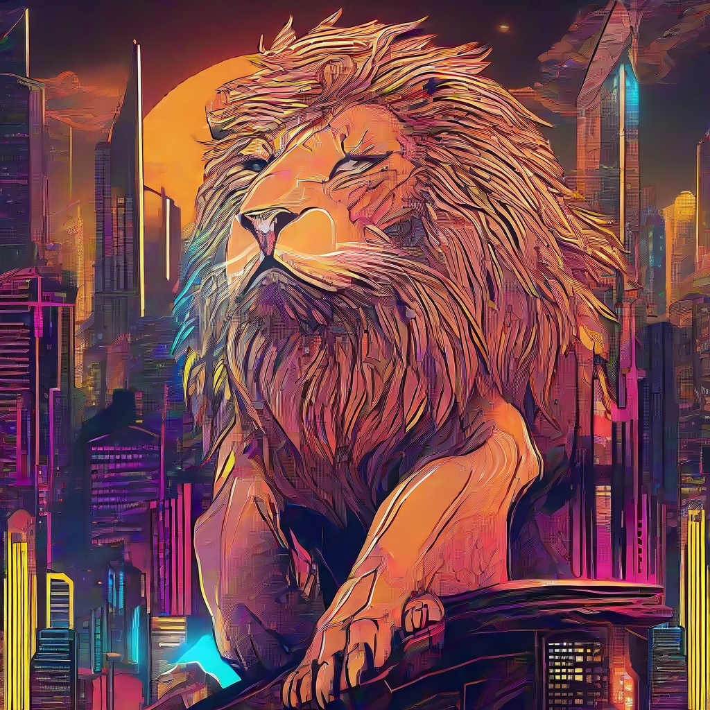

# Please don’t simply redeploy my code with a name change; take the time to understand it and build your own version.
# 🎨 AI Image Generator with Style Presets

An AI-powered image generator built with **Streamlit** and **Stable Diffusion XL**, allowing users to blend their own prompts with preset artistic styles stored in an Excel file.  
Perfect for quickly generating high-quality, styled images without manually crafting complex prompts.

---

## 🚀 Live Demo
Try it here: **[Live on Hugging Face Spaces](https://huggingface.co/spaces/liljujutsu/Streamlit_vision_Gen_Image)**  
*(Requires GPU Space for SDXL — may take a few seconds to load)*

---

## 📸 Demo Images

| Pixar Style | Cyberpunk | 
|-------------|-----------|
|  |  | 

> *These are sample outputs generated using the included style presets.*

---

## ✨ Features
- **Excel-based style presets** — easily add or edit styles without touching code.
- **Dropdown style selection** — pick from multiple artistic styles instantly.
- **Custom prompt blending** — your text + style prompt = unique image.
- **Negative prompt control** — improve quality by avoiding unwanted elements.
- **Streamlit UI** — simple, interactive, and browser-based.

---

## 📦 Installation

1. **Clone the repository**
   ```bash
   git clone https://github.com/your-username/your-repo.git
   cd your-repo
   ```

2. **Create a virtual environment (optional but recommended)**
   ```bash
   python -m venv .venv
   source .venv/bin/activate   # Linux/Mac
   .venv\Scripts\activate      # Windows
   ```

3. **Install dependencies**
   ```bash
   pip install -r requirements.txt
   ```

4. **Add your `styles.xlsx` file**  
   Example format:
   | name         | prompt                                         | negative_prompt                       |
   |--------------|-----------------------------------------------|----------------------------------------|
   | Pixar Style  | in Pixar animation style, colorful, cinematic | blurry, ugly, watermark, low resolution |
   | Cyberpunk    | cyberpunk cityscape, neon lights, futuristic  | low quality, distorted, bad anatomy    |

---

## 🚀 Usage

Run locally:
```bash
streamlit run app.py
```
Then open the provided local URL in your browser.

---

## 🛠 Tech Stack
- **Python**
- **Streamlit** — UI framework
- **Pandas** — Excel handling
- **Diffusers** — Stable Diffusion XL
- **PyTorch**
- **OpenPyXL** — Excel file reading

---

## 📜 License
mit @ 2025 khushal

---

## 🤝 Contributing
Pull requests are welcome!  
For major changes, please open an issue first to discuss what you would like to change.

---


