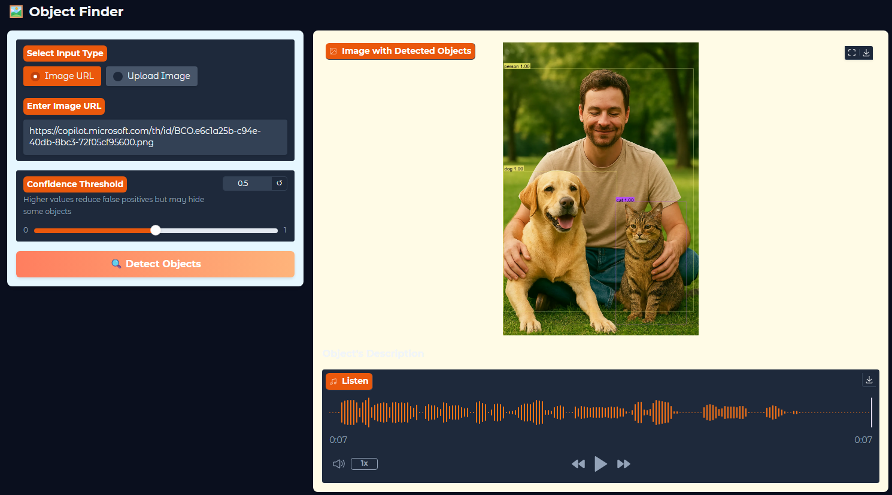
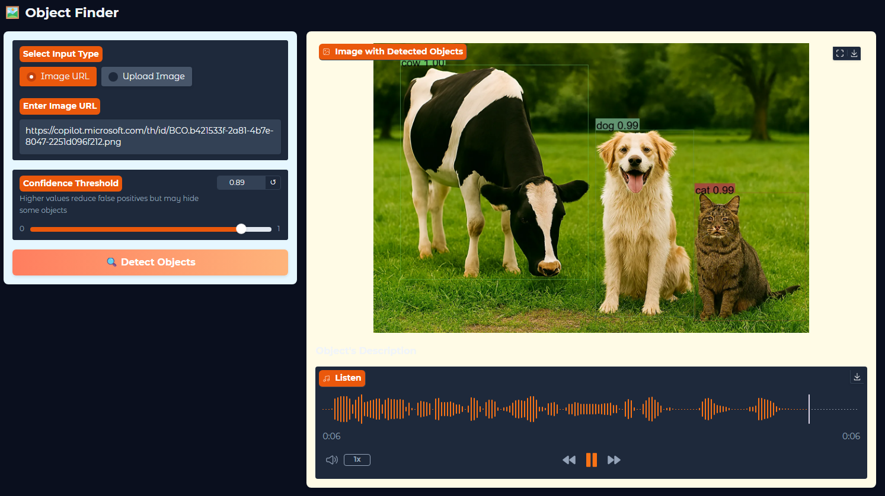

# 🖼️ Object Finder — Detect Objects from URL or Upload

An interactive web app built with [Gradio](https://gradio.app/) and [Hugging Face Transformers](https://huggingface.co/) that detects objects in an image and highlights them with bounding boxes.  
Users can choose to **paste an image URL** or **upload a file** — only one input is active at a time.  
The app also generates an **audio description** of the detected objects for accessibility.

---

## 🚀 Live Demo

[](https://huggingface.co/spaces/liljujutsu/findy_mater_audio_assist)

---

## 📸 SHOW CASE

| SHOW 1                         |
| ------------------------------ |
|  |

| SHOW 2                         |
| ------------------------------ |
|  |

## ✨ Features

- **Dual Input Mode** — Choose between image URL or file upload.
- **High‑visibility bounding boxes** with distinct colors.
- **Confidence threshold slider** to filter low‑confidence detections.
- **Audio description** of detected objects (play or download).
- **Download processed image** with annotations.
- **Responsive layout** for desktop and mobile.

---

## 🛠️ Tech Stack

- **Python 3.10+**
- [Gradio](https://gradio.app/) — UI framework
- [Transformers](https://huggingface.co/docs/transformers/index) — DETR object detection model
- [Pillow](https://pillow.readthedocs.io/) — Image processing
- [gTTS](https://pypi.org/project/gTTS/) — Text‑to‑speech for audio descriptions

---

## 📦 Installation

```bash
# Clone the repository
git clone https://github.com/yourusername/object-finder.git
cd object-finder

# Install dependencies
pip install -r requirements.txt

# Run the app
python app.py
```

---

## ⚙️ Usage

1. Select **Image URL** or **Upload Image**.
2. Paste the URL or upload a file.
3. Adjust the **confidence threshold** if needed.
4. Click **Detect Objects**.
5. View and download the annotated image.
6. Play or download the generated audio description.

---

## 📄 License

MIT License © 2025 khushal

---

## 🙌 Acknowledgements

- [facebook/detr-resnet-50](https://huggingface.co/facebook/detr-resnet-50) for object detection.
- [Gradio](https://gradio.app/) for the interactive UI.
- [Hugging Face](https://huggingface.co/) for model hosting.
